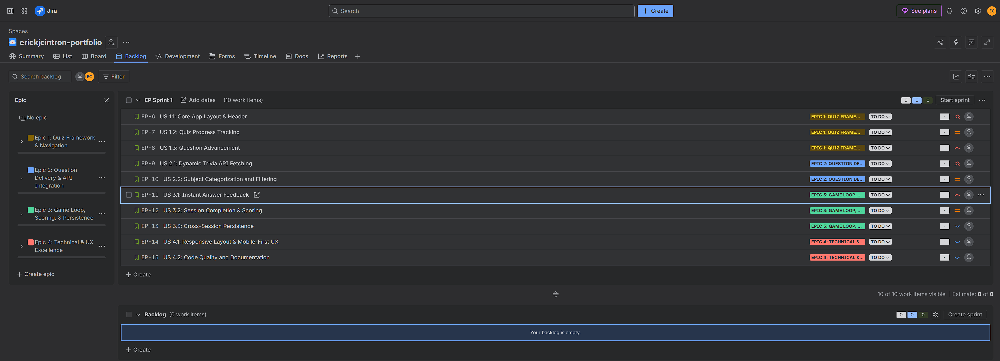

# Chingu Trivia - Product Owner Project Backlog

## Epic 1: Quiz Framework & Navigation
Focuses on the core structure, layout, and moving through the trivia application.

### US 1.1: Core App Layout & Header
**User Story:**
As a Trivia Player,  
I want a clean, modern webpage header with the app name and navigation tabs,  
So that I can easily identify the app and navigate through its sections.

**Acceptance Criteria:**
- Given the user loads the app, then a prominent header must display the application name ("Chingu Trivia").
- Given the header layout, then it must include navigation tabs if required for future features.
- Given different screen sizes, then the header must be responsive and not cause horizontal viewport scrolling.

---

### US 1.2: Quiz Progress Tracking
**User Story:**
As a Trivia Player,  
I want to see my current question number relative to the total number of questions,  
So that I know exactly how far along I am in the trivia session.

**Acceptance Criteria:**
- Given a trivia session is active, then an indicator must display the current status in a format exactly like 'Question X / Y' (e.g., 'Question 1 / 10').
- Given the user advances to the next question, then the current question number 'X' must increment by 1.

---

### US 1.3: Question Advancement
**User Story:**
As a Trivia Player,  
I want a clear way to move to the next question only after I have submitted an answer,  
So that I don't accidentally skip questions or advance without participating.

**Acceptance Criteria:**
- Given a new question has just loaded, then the "Next Question" button must be either completely hidden or disabled (not clickable).
- Given the user has selected and submitted an answer, then the "Next Question" button must become visible and active.
- Given the user clicks the active "Next Question" button, then the next question card must load without reloading the entire browser page.

---

## Epic 2: Question Delivery & API Integration
Focuses on fetching, filtering, and presenting the trivia data dynamically.

### US 2.1: Dynamic Trivia API Fetching
**User Story:**
As a Trivia Player,  
I want the application to seamlessly fetch and display questions from the remote Chingu API on page load,  
So that I can start playing immediately without manual setup.

**Acceptance Criteria:**
- Given the application loads, then it must make a static fetch request to https://johnmeade-webdev.github.io/chingu_quiz_api/trial.json
- Given a successful API response, then the first question must render automatically on a clean card format.
- Given the API data structures, then the app must elegantly handle both Multiple Choice and True/False question types.

---

### US 2.2: Subject Categorization and Filtering
**User Story:**
As a Trivia Player,  
I want to sort and filter trivia questions by their subject matter,  
So that I can test my knowledge on specific topics of my choosing.

**Acceptance Criteria:**
- Given the API data is fetched, then the app must parse the payload to extract all unique available subjects.
- Given a subject selector (dropdown or filter tabs), then the user must be able to choose a specific subject.
- Given a subject filter is applied, then the quiz must dynamically adjust to span only the questions matching that selected subject, updating the total question count tracker accordingly.

---

## Epic 3: Game Loop, Scoring, & Persistence
Focuses on user interaction feedback, end-game states, and cross-session tracking.

### US 3.1: Instant Answer Feedback
**User Story:**
As a Trivia Player,  
I want to see an immediate right/wrong message after submitting an answer,  
So that I know if my choice was correct before moving forward.

**Acceptance Criteria:**
- Given an answer is selected, then the application must evaluate it against the correct answer key.
- Given the evaluation is complete, then a clear UI message must immediately inform the user whether they were "Right" or "Wrong".

---

### US 3.2: Session Completion & Scoring
**User Story:**
As a Trivia Player,  
I want to see a dedicated completion screen with my total score when the session ends,  
So that I can evaluate my performance and celebrate finishing the quiz.

**Acceptance Criteria:**
- Given the user answers the final question of the set and clicks "Next/Finish", then a clear final screen must replace the question card.
- Given the final screen is active, then it must display a prominent message stating the trivia session is complete alongside the user's final score.

---

### US 3.3: Cross-Session Persistence
**User Story:**
As a Returning Trivia Player,  
I want the app to remember my progress across browser sessions,  
So that I never encounter repeat questions until I explicitly choose to reset my data.

**Acceptance Criteria:**
- Given a user completes questions or sessions, then answered question IDs must be tracked using a backend persistence layer or local storage.
- Given the user reloads the app later, then those previously answered questions must not reappear in future sessions.
- Given the user wants to start completely over, then a "Clear Progress" mechanism must be available to erase historical data and refresh the question pool.

---

## Epic 4: Technical & UX Excellence
Focuses on responsive design, edge cases, and code health.

### US 4.1: Responsive Layout & Mobile-First UX
**User Story:**
As a Mobile Trivia Player,  
I want the answer options to stack vertically on small mobile screens (like an iPhone 5),  
So that I can easily tap the buttons without zooming or horizontal scrolling.

**Acceptance Criteria:**
- Given a viewport size of mobile dimensions (e.g., width <= 576px), then answer options must smoothly collapse into a single-column layout.
- Given any device, the layout must completely fit the screen without overflowing or forcing horizontal scrolling.

---

### US 4.2: Code Quality and Documentation
**User Story:**
As a Maintainer / Reviewer,  
I want the codebase to have a robust README.md and zero console errors,  
So that the project can be confidently reviewed, deployed, and scaled.

**Acceptance Criteria:**
- Given the developer console is open during runtime or user interactions, then zero errors or unhandled warnings should be logged.
- Given the repository root, then a robust README.md must detail setup instructions, project scope, and features.

## Jira Backlog Board Screenshot

